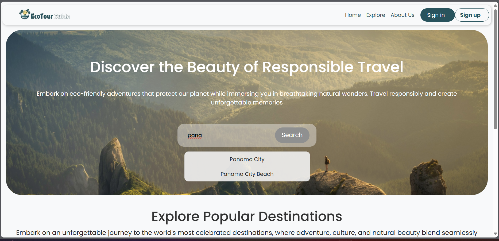
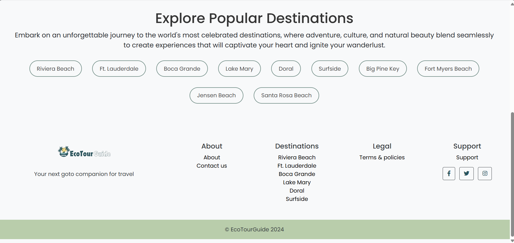
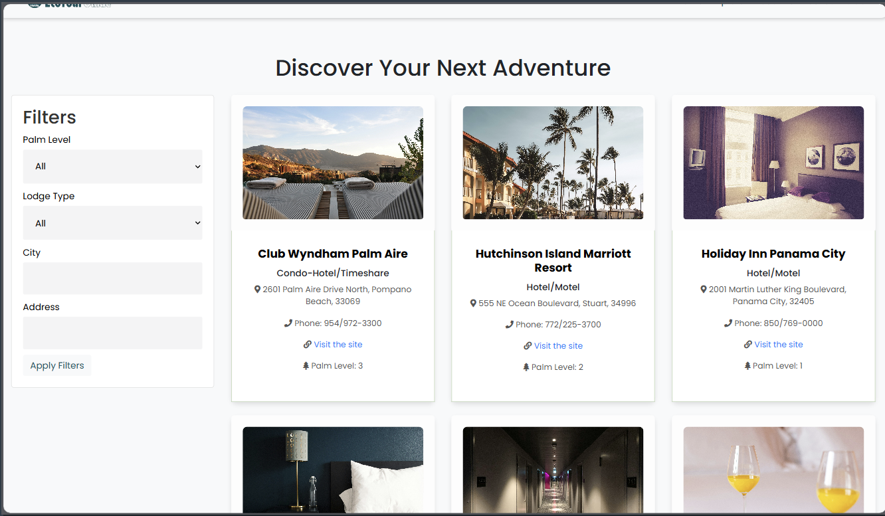
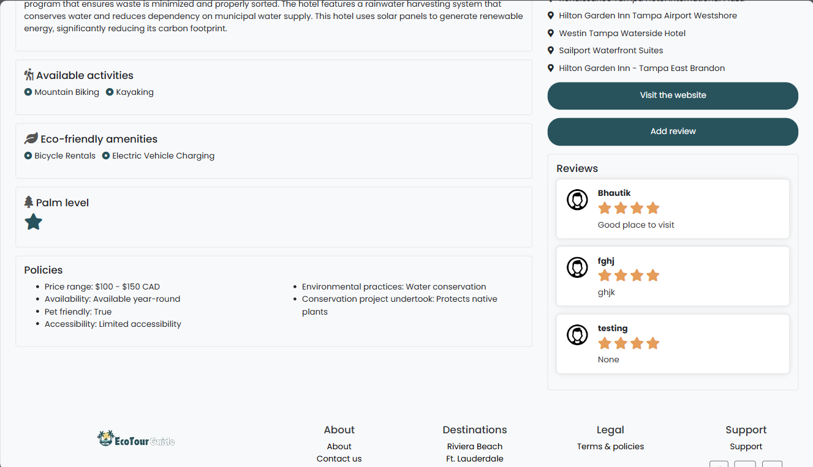
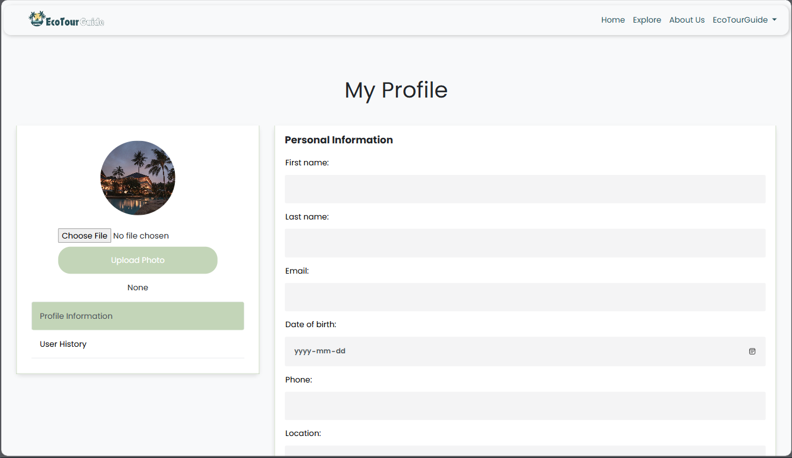

# Eco-Tourism Guide

## Introduction
The Eco-Tourism Guide is a Django-based web platform designed to promote sustainable travel. Our platform provides information on eco-friendly travel destinations and activities, featuring a comprehensive directory of accommodations, tours, and conservation projects that prioritize environmental responsibility. Users can browse, review, and book eco-friendly travel options, fostering a community of like-minded travelers committed to reducing their environmental impact.

## Table of Contents
- [Introduction](#introduction)
- [Features](#features)
- [User Interface](#user-interface)
- [Installation](#installation)
- [Usage](#usage)
- [Configuration](#configuration)

## Features
1. **User Registration and Login**
    - Users can create accounts to access personalized features and save their preferences.
    - User authentication is implemented using Django's built-in authentication system.
    - Features include user registration, login, logout, and password recovery.

2. **Directory of Eco-Friendly Travel Options**
    - A curated list of eco-friendly accommodations, tours, and activities.
    - Each entry includes details such as description, location, price, and eco-friendly practices.

3. **Detailed Pages for Destinations**
    - Individual pages for each travel option with detailed information and user-generated content.
    - Includes descriptions, images, reviews, and ratings.

4. **Booking Functionality**
    - Allows users to book eco-friendly accommodations and tours directly through the website.
    - Booking requests can be managed by site administrators or integrated with external booking APIs.

5. **Search Functionality with Filters**
    - A powerful search bar that allows users to find travel options based on various criteria.
    - Filters include location, price range, type of activity, and eco-friendly certifications.

6. **User History Tracking**
    - Tracks and displays users' activity on the website.
    - Provides a personalized dashboard for users to view their history and recommendations.

7. **User Reviews and Ratings**
    - Allows users to share their experiences and rate travel options.
    - Reviews are displayed on the corresponding destination pages.

8. **Travel Photos and Reviews Upload**
    - Users can upload photos and detailed reviews of their trips.
    - File upload functionality is implemented to allow users to share their travel photos.

## User Interface
<div style="overflow-x: scroll; white-space: nowrap;">
    
    
    
    
    
    
</div>

## Installation
1. Clone the repository:
    ```bash
    git clone https://github.com/yourusername/eco-tourism-guide.git
    ```
2. Navigate to the project directory:
    ```bash
    cd eco-tourism-guide
    ```
3. Make migrations:
    ```bash
    python manage.py makemigrations
    ```
4. Apply migrations:
    ```bash
    python manage.py migrate
    ```
5. Run the development server:
    ```bash
    python manage.py runserver
    ```

## Usage
1. Register for an account or log in if you already have one.
2. Browse the directory of eco-friendly travel options.
3. View detailed pages for each destination to learn more about their eco-friendly practices.
4. Use the search functionality to find travel options that meet your criteria.
5. Book accommodations and tours directly through the website.
6. Leave reviews and upload photos of your travels to share your experiences with the community.

## Configuration
- Database settings and other configurations can be found in the `settings.py` file.
- Customize settings such as `DEBUG`, `ALLOWED_HOSTS`, and database configurations as needed.
